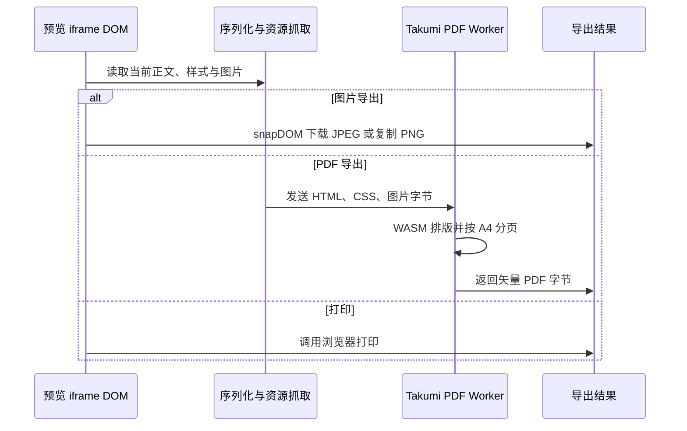

# 架构设计

本文档介绍 bm.md 的技术架构设计。

---

## 技术栈

| 类别     | 技术                                        |
| -------- | ------------------------------------------- |
| 框架     | TanStack Start (React 19 + TanStack Router) |
| 构建     | Vite 8                                      |
| 样式     | Tailwind CSS 4 + shadcn/ui                  |
| 语言     | TypeScript (`strict: true`)                 |
| 状态管理 | Zustand                                     |
| 包管理   | pnpm                                        |
| 测试     | Vitest                                      |
| 校验     | Zod                                         |

### 依赖说明

- `mcp-config` 保留 GitHub 依赖，因为当前 MCP 配置页使用其 `getClients`、`transformConfig` 与 `mcp-config/src/index.js` 入口，而 npm 包不提供兼容导出与入口。

---

## 项目结构

```
src/
├── cli/                 # bmmd 命令行入口
├── components/          # React 组件
│   ├── command-palette/ # 命令面板
│   ├── dialog/          # 弹窗组件
│   ├── file-tabs/       # 文件标签页（多文件管理）
│   ├── logo/            # Logo 组件
│   ├── markdown/        # Markdown 编辑器与预览器
│   │   ├── editor/      # CodeMirror 编辑器
│   │   ├── previewer/   # 预览渲染器
│   │   ├── footer-bar/  # 底部操作栏
│   │   └── hooks/       # 共享 Hooks
│   ├── mockups/         # 设备模拟框（iPhone/Safari）
│   ├── not-found/       # 404 页面
│   └── ui/              # shadcn/ui 组件（CLI 管理）
├── config/              # 应用、命令面板与 API 文档配置
├── env/                 # 环境变量管理
├── hooks/               # 全局 Hooks（use-files-sync 等）
├── icons/               # 自定义图标
├── lib/                 # 核心业务逻辑
│   ├── actions/         # 用户操作（导入/导出/复制）
│   ├── pdf/             # PDF 快照、资源处理、Worker 与协议
│   ├── file-storage.ts  # IndexedDB 文件存储
│   ├── file-importer.ts # 文件分类、解析与标签创建
│   ├── upload-image.ts  # 图片上传客户端边界（ofetch + Zod）
│   └── markdown/        # Markdown 处理管道
│       ├── definitions.ts # 唯一 markdownTools registry
│       ├── extract/     # 文本提取
│       ├── lint/        # 格式校验
│       ├── parse/       # HTML → Markdown
│       ├── render/      # Markdown → HTML
│       ├── api.ts       # OpenAPI 请求处理器
│       ├── browser.ts、client-render.ts # 浏览器 Worker 客户端与渲染边界
│       ├── router.ts、worker.ts # oRPC procedure 与 Worker 入口
│       ├── mcp.ts       # 从 registry 注册 MCP 工具
│       └── types/       # 工具与 CLI 定义类型
├── router.tsx           # TanStack Router 实例
├── routes/              # TanStack Router 路由
├── storage/             # 云端存储抽象层
│   ├── index.ts         # 存储入口（自动选择 S3/DC）
│   ├── s3-storage.ts    # S3 兼容存储
│   ├── dc-storage.ts    # DC 图床存储
│   └── types.ts         # 存储类型定义
├── stores/              # Zustand 状态管理
├── styles.css           # Tailwind 入口与全局基础样式
├── styles/              # 滚动条与主题切换动画
├── themes/              # 主题配置
│   ├── code-theme/      # 代码高亮主题
│   ├── codemirror/      # 编辑器主题
│   ├── infographic-theme/ # Infographic 主题与调色板
│   ├── markdown-style/  # Markdown 排版样式
│   ├── mermaid-theme/   # Mermaid 主题
│   ├── palette/         # 统一调色板
│   └── shadcn/          # shadcn 主题定制
└── utils/               # 工具函数
```

---

## 核心流程

### Markdown 处理管道

`src/lib/markdown/definitions.ts` 中的 `markdownTools` 是 `render`、`parse`、`extract`、`lint` 的唯一 registry，将 schema、元信息、CLI 声明与惰性 `run` 绑定。公开 API、CLI 与 MCP 均遍历该 registry 派生；Worker 复用同一组 procedure，并额外提供内部 `preview`。

各工具实现分别位于 `render/html.ts`、`parse/html.ts`、`extract/text.ts` 与 `lint/markdown.ts`。旧的 per-tool `index.ts`、`tools.ts` 和 `rpc.ts` 已删除。

### 渲染流程详解

1. **解析阶段** - `remark-parse` 解析 Markdown AST
2. **扩展处理** - 支持 GFM、Math 与 Frontmatter，并将 YAML/TOML Frontmatter 转换为可排版的表格
3. **转换阶段** - `remark-rehype` 转为 HTML AST
4. **增强阶段** - 外部链接、GitHub Alert、KaTeX、代码高亮，以及通过 `beautiful-mermaid` 渲染 Mermaid、通过 `@antv/infographic/ssr` 渲染 Infographic；生成的 SVG 经过安全清理
5. **平台适配** - 微信使用专门适配；HTML 使用通用输出
6. **输出整形** - 在块级内容中，将非空的直接文本节点包装为 `span`，为末端排版和样式内联提供稳定结构
7. **样式内联** - `juice` 将 CSS 内联到元素

### 平台适配器

针对不同平台的输出策略：

| 平台   | 适配内容                                           |
| ------ | -------------------------------------------------- |
| HTML   | 通用 HTML 输出                                     |
| WeChat | 链接转脚注、代码空格用 `\u00A0` 保护、表格滚动容器 |

### 图片、PDF 与打印导出

导出操作以已经写入预览 iframe 的当前正文与样式为输入：


```mermaid
sequenceDiagram
  participant P as 预览 iframe DOM
  participant S as 序列化与资源抓取
  participant R as Takumi PDF Worker
  participant O as 导出结果
  P->>S: 读取当前正文、样式与图片
  alt 图片导出
    P->>O: snapDOM 下载 JPEG 或复制 PNG
  else PDF 导出
    S->>R: 发送 HTML、CSS、图片字节
    R->>R: WASM 排版并按 A4 分页
    R->>O: 返回矢量 PDF 字节
  else 打印
    P->>O: 调用浏览器打印
  end
```

PDF 导出不重新执行 Markdown 或脚本。主线程快照预览 iframe 的 HTML、样式、基础背景色与图片地址，抓取图片字节后交给模块级复用的 Worker；Worker 用 Takumi PDF WASM 排版为 A4 矢量 PDF（可选文字、标题书签）。`takumi-pdf` 与 `@takumi-rs/helpers` 作为同一升级组维护。字体或运行时不可用时，导出入口降级为打开浏览器打印。

**主线程快照**

- 克隆预览内容并移除脚本；按 content → body → html 选取首个不透明背景色。
- 读取可访问 stylesheet，并对 stylesheet、内联 style、克隆内 `<style>` 做窄范围 `overflow` 兼容（`auto`/`scroll` → `visible`），不改选择器、字符串、URL、自定义属性，也不静默删其他未知 CSS。
- 解析 `` 地址、加载字节、选择字体族与 PDF 专用样式后，组装为 `PdfRenderInput`。

**browser / Worker 协议与 transferable**

- 请求：`PdfRenderInput`（含 `images: FetchedImage[]`）。发送时 `postMessage` 转移各图 `data`（ArrayBuffer）。
- 响应为判别联合 `PdfWorkerResponse`：
  - 成功：`{ success: true, pdf: ArrayBuffer }`，PDF 以 transferable 回传。
  - 缺字：`{ success: false, kind: 'missingGlyphs', codepoints, images }`——**仅此路径**把图片所有权转回主线程，供恢复后再次发送。
  - 其他失败：`fontUnavailable` | `renderFailed` | `runtimeUnavailable`，不附带图片。
- 缺字替换记录 `replacements` 只留在 browser 侧，不进入 Worker 协议。
- 流程：初始渲染一次；若 `missingGlyphs`，主线程恢复后最多再试 3 次（合计最多 4 次 Worker 往返）。仍失败则报错。

**字体与缺字恢复**

- Worker 经 Takumi `googleFonts()` 加载 Noto：Serif 字重 `200..900`，Sans 字重 `100..900`，区域 SC/TC/JP/KR；有代码块时加 Noto Sans Mono；正文含 Emoji/符号时再加 Noto Color Emoji、Noto Emoji。Google Fonts `.cn` 为 bm.md 镜像策略，非 Takumi 官方 endpoint。字体保留 `unicode-range`，只下载实际用到的分片。
- 缺字时主线程：在文本节点按 grapheme 将无法覆盖的字符换为 `□`（不改属性）；对仍未覆盖、且尚未探针过的码点，向 `#bm-md` 追加不可见 **generated Emoji/CJK 探针** 并扩展 `fontFamilies`，再重试。同一码点探针失败则终止。
- 字体响应写入 Cache Storage（best-effort）；缓存故障不阻断在线加载。生产 PWA 预缓存 PDF Worker 与 Takumi WASM，不预缓存字体。

**图片资源限制**

- 只保证抓取 `` 并保留内联 SVG；外部 CSS `background` / `mask` 图片不主动抓取。
- `` 外链须可 CORS 读取。上限：单图 20 MiB、总量 64 MiB、最多 64 个不同图片地址、并发 4、单次超时 30 秒；流式读取，越界立即取消。

**Takumi CSS 与分页边界**

- 基础背景色经 `backgroundColor` 铺满整张纸（含 margin）；主题渐变/纹理仍在 `#bm-md`，仅覆盖正文区域。
- 原生四边 margin：上/下 45、左/右 30；不注入 fixed 页面背景，不用根 padding 模拟分页。
- 仅使用 Takumi 支持的 CSS 子集与 break 规则分页；不执行预览中的 JavaScript，不再维护 Canvas/SVG 手工切页。

---

## 状态管理

使用 Zustand 进行状态管理，分为 4 个独立 Store：

### Store 架构

- `filesStore`：文件 catalog、活动文件、当前正文及其加载状态；通过 `contentFileId`、`contentVersion`、`contentEpoch` 标识正文身份与版本
- `editorStore`：滚动位置/来源，以及引用链接、新窗口打开、滚动同步三项编辑设置
- `previewStore`：预览宽度和配色、Markdown/代码/Mermaid/Infographic 主题、自定义 CSS 与当前渲染签名
- `commandPaletteStore`：命令面板开关与当前子菜单

### 持久化策略

| Store               | 存储位置/Key                                              | 持久化内容                                                                                                     |
| ------------------- | --------------------------------------------------------- | -------------------------------------------------------------------------------------------------------------- |
| filesStore          | IndexedDB `bm.md` v2；sessionStorage `bm.md.files.active` | `catalog` 中的文件元数据与 revision、`files` 中的正文与 version；当前标签的活动文件 ID                         |
| filesStore 同步信号 | localStorage `bm.md.files.signal`                         | 仅保存 catalog/正文的 revision/version 失效通知，不保存文件快照                                                |
| editorStore         | localStorage `bm.md.editor`                               | `enableFootnoteLinks`、`openLinksInNewWindow`、`enableScrollSync`（不含滚动状态）                              |
| previewStore        | localStorage `bm.md.preview`                              | `previewWidth`、`previewColorScheme`、`markdownStyle`、`codeTheme`、`mermaidTheme`、`infographic`、`customCss` |
| commandPaletteStore | -                                                         | 不持久化                                                                                                       |

### Store 交互

- `editorStore` 与 `previewStore` 使用 `skipHydration`，由 `src/lib/client-integrations.ts` 在客户端显式调用 `persist.rehydrate()`
- 预览 HTML 只保存在 iframe 中；`renderedSignature` 仅标识当前输入是否已真正提交，不进入持久化存储
- `filesStore` 不使用 Zustand persist。文件 catalog 是 IndexedDB 唯一事实源，`activeFileId` 是标签页私有会话状态
- 正文只在 `contentStatus=ready` 且 `contentFileId=activeFileId` 时允许编辑；切换加载期间编辑器和导出入口均关闭
- 组件通过 Hooks 订阅 Store，实现响应式更新

---

## 存储架构

### 本地存储（文件 catalog 与正文）

使用 IndexedDB 存储用户的 Markdown 文档内容：

```
┌──────────────────────────────────────────────────────────────┐
│                    file-storage.ts                           │
├──────────────────────────────────────────────────────────────┤
│  IndexedDB (idb, v2)                                         │
│  ├─ Database: bm.md                                          │
│  ├─ ObjectStore: catalog                                     │
│  │   └─ { key: "main", revision, files[] }                  │
│  └─ ObjectStore: files                                       │
│      └─ { id: string, content: string, version: number }     │
├──────────────────────────────────────────────────────────────┤
│  降级策略                                                     │
│  ├─ 首次打开不可用时降级为内存存储                             │
│  └─ 运行期失败保留内存草稿并阻止破坏性切换                     │
└──────────────────────────────────────────────────────────────┘
```

create、rename、delete 会在 IndexedDB 事务内读取最新 catalog；create/delete 同时修改正文 Store，避免 metadata 与正文半提交。正文保存先确认 catalog 中仍存在文件，再递增独立 `version`，因此删除后的迟到保存不会复活文件。

跨标签同步不传递全量快照：提交方只写入 `bm.md.files.signal` revision/version 通知，接收方重读 IndexedDB，且不会回写通知。文件列表共享，活动标签通过 sessionStorage 保持各标签独立；同一正文并发编辑采用 version 排序的 last-writer-wins。正文首笔编辑立即写入，连续输入在 150ms 尾随窗口内合并，显式切换或页面隐藏会立即 flush。

旧版 `localStorage['bm.md.files']` 仅用于一次性迁移到 v2 catalog，迁移成功后删除。

`src/lib/file-importer.ts` 统一分类导入文件：直接读取 `.md`、`.markdown`、`.mdown`、`.mkd`（大小写不敏感），HTML 经 Markdown Worker 转换；Word、PowerPoint、Excel、OpenDocument、RTF、EPUB、CSV、PDF 等文档则通过 `src/lib/document/browser.ts` 串行发送到文档 Worker，由 AnyDoc WASM 转换为 Markdown。可转换文档单个限制为 20MB，超限会在进入 Worker 前拒绝。批量导入按原始顺序创建标签；`filesStore.createFile()` 创建文件后立即将其设为活动文件，因此最后创建的文件保持激活。

### 云端存储（图片上传）

客户端上传边界是 `src/lib/upload-image.ts`：使用 `ofetch` 请求同源或 `VITE_API_URL` 下的 `/api/upload/image`，并用 Zod 校验成功响应、统一提取错误信息。旧的 `services` 上传层与顶层 `lib/api` helper 已删除。

服务端路由 `src/routes/api.upload.image.ts` 校验表单、图片大小和 PNG/JPEG/GIF/WebP 文件签名，并由检测结果决定扩展名和 Content-Type，再通过 `src/storage/index.ts` 选择 S3 兼容存储或 DC 图床：

```
┌──────────────────────────────────────────────────────────────┐
│                    storage/index.ts                          │
├──────────────────────────────────────────────────────────────┤
│  isS3Configured()                                            │
│  ├─ true  → S3Storage (Cloudflare R2, MinIO, AWS S3)         │
│  └─ false → DCStorage (默认图床)                              │
├──────────────────────────────────────────────────────────────┤
│  环境变量                                                     │
│  ├─ S3 必需：S3_ACCESS_KEY_ID                                 │
│  ├─ S3 必需：S3_SECRET_ACCESS_KEY                             │
│  ├─ S3 必需：S3_ENDPOINT                                     │
│  ├─ S3 可选：S3_BUCKET、S3_REGION、S3_PUBLIC_BASE_URL         │
│  └─ DC 可选：DC_UPLOAD_URL                                   │
└──────────────────────────────────────────────────────────────┘
```

只有 `S3_ACCESS_KEY_ID`、`S3_SECRET_ACCESS_KEY`、`S3_ENDPOINT` 同时存在时才判定启用 S3。`S3_BUCKET` 可用于拼接上传路径，`S3_REGION` 默认 `auto`，`S3_PUBLIC_BASE_URL` 可指定返回给客户端的公开地址；未启用 S3 时使用 DC 图床，`DC_UPLOAD_URL` 可覆盖其默认上传地址。

---

## 路由设计

基于 TanStack Router 的文件路由系统：

### 页面路由

| 路径          | 文件                     | 说明                    |
| ------------- | ------------------------ | ----------------------- |
| `/`           | `_layout.index.tsx`      | 主页（编辑器 + 预览器） |
| `/about`      | `_layout.about.tsx`      | 关于页面（弹窗）        |
| `/docs`       | `docs.tsx`               | API 文档（Scalar UI）   |
| `/docs/mcp`   | `_layout.docs.mcp.tsx`   | MCP 配置说明（弹窗）    |
| `/docs/skill` | `_layout.docs.skill.tsx` | AI Skill 文档（弹窗）   |

### API 路由

| 路径                | 文件                  | 说明                 |
| ------------------- | --------------------- | -------------------- |
| `/api/*`            | `api.$.ts`            | Markdown API（oRPC） |
| `/api/upload/image` | `api.upload.image.ts` | 图片上传             |
| `/mcp`              | `mcp.ts`              | MCP 协议端点         |

### 布局结构

```
__root.tsx (HTML 文档结构、全局 Provider)
├── _layout.tsx (主布局：编辑器 | 预览器 | 底栏)
│   ├── _layout.index.tsx (首页)
│   ├── _layout.about.tsx (关于弹窗)
│   ├── _layout.docs.mcp.tsx (MCP 弹窗)
│   └── _layout.docs.skill.tsx (Skill 弹窗)
└── docs.tsx (root-level API 文档 sibling)
```

---

## Worker 架构

Markdown 渲染在 Web Worker 中执行，避免阻塞主线程：

```
┌──────────────┐         oRPC          ┌──────────────┐
│  Main Thread │ ◄─────────────────► │  Web Worker  │
│              │                       │              │
│  • UI 渲染   │                       │  • Markdown  │
│  • 用户交互  │                       │    处理管道  │
│  • 状态管理  │                       │  • 重计算    │
└──────────────┘                       └──────────────┘
```

### 通信方式

- 使用 oRPC 的 Web Workers Adapter
- 支持双向通信
- 类型安全的 RPC 调用
- 可转换文档使用独立的文档 Worker，通过 AnyDoc WASM 输出 Markdown；客户端串行提交任务并设置超时，避免转换阻塞 UI 或叠加 WASM 内存峰值

---

## 部署支持

基于 Nitro 构建，支持多种部署平台：

| 平台               | 说明                  |
| ------------------ | --------------------- |
| Cloudflare Workers | Edge Runtime          |
| Vercel             | Serverless Functions  |
| Netlify            | Serverless Functions  |
| Node.js (Docker)   | 传统服务器部署        |
| 阿里云 ESA         | Edge Runtime          |
| 腾讯云 EdgeOne     | Node.js Runtime       |
| 其他               | 任意 Nitro 支持的平台 |

### 环境检测

`scripts/vite/platform.ts` 集中解析部署环境，`vite.config.ts` 使用其结果配置 Nitro、预渲染与 PWA 输出目录。阿里云 ESA 优先；EdgeOne 优先由 std-env 的 `edgeone_pages` 检测，并以平台提供的 `EDGEONE_PROJECT_ID` / `EO_MAKERS` 回退识别：

```typescript
const isAliyunESA = Boolean(environment.AliUid)
const isEdgeOneProvider = detectedProvider === 'edgeone_pages'
const isTencentEdgeOne
  = isEdgeOneProvider
    || Boolean(environment.EDGEONE_PROJECT_ID)
    || Boolean(environment.EO_MAKERS)
```

- 存在 `AliUid` 时使用 `./preset/aliyun-esa/nitro.config.ts`，预渲染 `/`、`/about` 与 `/docs/*`，并将 PWA 输出到 `dist/client`
- std-env 检测到 `edgeone_pages`，或存在非空的 `EDGEONE_PROJECT_ID` / `EO_MAKERS` 时识别为 EdgeOne；std-env 命中时由 Nitro 自动选择 preset，回退变量命中时项目内部选择官方 `edgeone-pages` preset，用户均无需设置 `NITRO_PRESET`。官方 Node handler 不兼容本地 prerender preview，因此禁用 TanStack 构建期预渲染，并将 PWA 输出到 `.edgeone/assets`
- 其他环境不指定 preset，交由 Nitro 自动检测

---

## 接口与工具设计

### oRPC 架构

使用 oRPC 构建类型安全的 API。`src/lib/markdown/router.ts` 遍历 `markdownTools` 生成四个公开 procedure，避免维护第二份 handler 映射：

```
┌─────────────────────────────────────────────────────────────┐
│                        oRPC Router                          │
├─────────────────┬─────────────────┬─────────────────────────┤
│ markdown.render │ markdown.parse  │ markdown.extract/lint   │
├─────────────────┴─────────────────┴─────────────────────────┤
│                    OpenAPIHandler                           │
│                    (CORS, Error Handling)                   │
└─────────────────────────────────────────────────────────────┘
```

### CLI 集成

CLI 使用 `cac` 实现，入口为 `src/cli/index.ts`，构建后输出到 `bin/bmmd.mjs` 并通过 `package.json` 的 `bin.bmmd` 暴露。

```
┌─────────────────────────────────────────────────────────────┐
│                         bmmd CLI                            │
├─────────────────┬─────────────────┬─────────────────────────┤
│ bmmd render     │ bmmd parse      │ bmmd extract/lint       │
├─────────────────┴─────────────────┴─────────────────────────┤
│ src/lib/markdown/definitions.ts 提供唯一 markdownTools registry│
│ src/cli/core.ts 直接复用 registry 的 schema、CLI 声明与 run    │
│ src/cli/index.ts 遍历 registry 注册命令                        │
└─────────────────────────────────────────────────────────────┘
```

设计要点：

- **声明式命令** - `markdownTools` 汇总各工具的 Zod schema、CLI 输入字段、选项和执行函数，CLI 自动生成命令与帮助信息
- **统一校验** - CLI 执行前复用同一份 Zod schema 校验参数，错误统一以 `bmmd: ...` 输出
- **输入输出一致** - 命令支持文件输入和 stdin；默认写 stdout，`--output <file>` 写入文件
- **特殊写回** - `bmmd lint <file> --fix` 将修复结果写回输入文件，且不能与 `--output` 同时使用
- **构建发布** - `pnpm build:cli` 使用 `tsdown.cli.config.ts` 生成 Node 20 ESM bundle，`prepack` 会在发布前自动构建

### MCP 集成

实现 Model Context Protocol 服务端：

`src/lib/markdown/mcp.ts` 遍历 `markdownTools` 注册工具，并只负责 MCP 配置与结果格式化。工具集合、schema 和执行逻辑不在 MCP 层重复声明。

---

## 构建优化

### Vite 插件

| 插件                                             | 功能                                        |
| ------------------------------------------------ | ------------------------------------------- |
| `fixNitroInlineDynamicImports`                   | 修正 Nitro 内联动态导入                     |
| `cssRawMinifyPlugin`、`markdownPlugin`           | CSS 原始导入压缩与 Markdown 文件导入        |
| `@tanstack/devtools-vite`                        | 开发调试工具                                |
| `nitro/vite`                                     | Nitro 服务端构建（测试环境除外）            |
| `@tailwindcss/vite`                              | Tailwind CSS 处理                           |
| `tanstackStart`、`@vitejs/plugin-react`          | TanStack Start 与 React 构建                |
| `@rolldown/plugin-babel` + `reactCompilerPreset` | 通过 Rolldown Babel 集成启用 React Compiler |
| `vite-plugin-pwa`                                | PWA 构建与 Service Worker 注入              |

### 客户端与 Worker 边界

- 命令面板通过 `ClientOnly` 仅在客户端渲染
- Worker 独立 bundle
