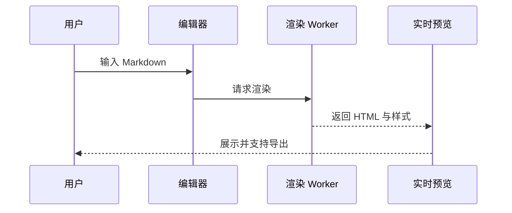
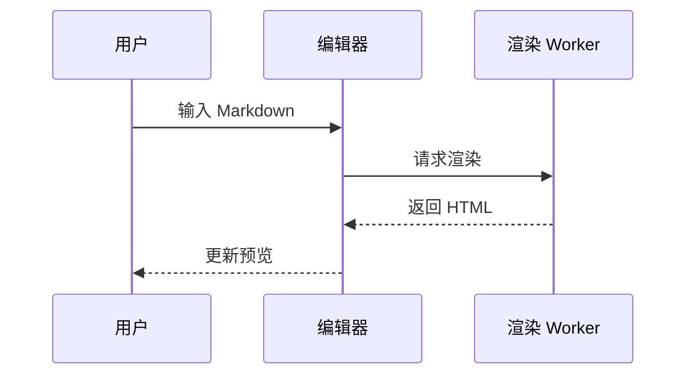

# bm.md

bm.md 是一个专业的 Markdown 排版工具，专为内容创作者设计。本文档详细介绍所有功能特性。

## 多文件管理

### 文件标签页

支持同时打开多个 Markdown 文件：

- **多标签切换** - 顶部标签栏显示所有打开的文件
- **重命名文件** - 双击标签或聚焦后按 F2
- **自动命名** - 根据文档首个 H1 标题自动命名
- **IndexedDB 存储** - 文件列表与内容事务化持久存储，刷新不丢失
- **新建文件** - 点击 + 按钮创建并立即激活新文件
- **关闭文件** - 点击 × 或聚焦标签后按 Delete

### 文件存储

- 文件元数据与正文统一存储在 IndexedDB，创建和删除保持事务一致
- 当前活动标签保存在 sessionStorage，不同浏览器标签页互不抢占
- 跨标签通过轻量 revision 通知重读 IndexedDB，文件列表与正文版本最终收敛
- 首次无法使用浏览器存储时自动降级为内存；运行期保存失败会保留可导出的内存草稿

---

## 编辑器功能

### Markdown 编辑器

基于 CodeMirror 6 构建的高性能编辑器：

- **语法高亮** - Markdown 语法实时着色
- **代码折叠** - 支持折叠代码块和长段落
- **Ayu 主题** - 与整体 UI 风格统一的编辑器配色

### 文件导入

支持多种方式导入内容：

- **统一文件识别** - 文件导入、拖拽与 PWA 文件关联统一支持 `.md`、`.markdown`、`.mdown`、`.mkd`，扩展名大小写不敏感
- **HTML 转换** - `.html`、`.htm` 文件经 Markdown Worker 转换后导入
- **拖拽导入** - 直接拖拽文件到编辑器区域
- **粘贴导入** - 支持粘贴 HTML 内容自动转换为 Markdown
- **快捷键** - `Cmd/Ctrl + O` 快速打开文件

### Markdown 格式化

一键美化 Markdown 代码：

- 基于 markdownlint 规则自动修复
- 统一标题、列表、空行等格式
- 快捷键 `Cmd/Ctrl + Shift + L`

### 导出 Markdown

将编辑器内容保存为本地文件：

- 导出为 `.md` 文件
- 快捷键 `Cmd/Ctrl + S`

---

## 预览功能

### 实时预览

编辑即可见的预览体验：

- **增量更新** - 使用 morphdom 进行 DOM diff，仅更新变化部分
- **防抖渲染** - 100ms 防抖，避免频繁渲染
- **样式隔离** - iframe 沙箱隔离，预览样式不影响编辑器
- **导出一致性** - 图片、PDF 与打印仅在当前正文和样式已写入预览 iframe 后启用

Mermaid 图表也会随 Markdown 渲染进入预览，例如下面的渲染流程：



### 视图切换

适配不同设备的预览宽度：

- **移动端视图** - 415px 宽度，iPhone 设备框展示
- **桌面端视图** - 768px 宽度，Safari 浏览器框展示
- **偏好持久化** - 刷新后保留用户选择的预览模式
- 拖动编辑器与预览区分割线不会切换模式或中断滚动同步

### 滚动同步

编辑器与预览区域双向滚动同步：

- 编辑器滚动时预览跟随
- 预览滚动时编辑器跟随
- 可通过设置开关此功能

---

## 主题系统

### Markdown 排版样式

内置 15 种精心设计的排版风格：

| 样式 ID             | 名称              | 风格描述                   |
| ------------------- | ----------------- | -------------------------- |
| `ayu-light`         | Ayu Light         | 清新淡雅的浅色主题         |
| `bauhaus`           | Bauhaus           | 包豪斯风格，几何与功能主义 |
| `blueprint`         | Blueprint         | 蓝图技术文档风格           |
| `botanical`         | Botanical         | 植物园风格，自然柔和       |
| `green-simple`      | GreenSimple       | 简约绿色风格               |
| `kami`              | Kami              | 纸张阅读风格               |
| `sketch`            | Sketch            | 手绘素描风格               |
| `newsprint`         | Newsprint         | 报纸印刷风格               |
| `terminal`          | Terminal          | 终端/命令行风格            |
| `neo-brutalism`     | Neo-Brutalism     | 新野兽派，大胆对比         |
| `playful-geometric` | Playful Geometric | 活泼几何图形风格           |
| `professional`      | Professional      | 专业商务风格               |
| `organic`           | Organic           | 有机自然风格               |
| `maximalism`        | Maximalism        | 极繁主义，丰富装饰         |
| `retro`             | Retro             | 复古怀旧风格               |

### 代码高亮主题

支持 14 种代码块高亮主题（来自 highlight.js）：

| 主题 ID                | 名称                 | 类型 |
| ---------------------- | -------------------- | ---- |
| `catppuccin-frappe`    | Catppuccin Frappé    | 深色 |
| `catppuccin-latte`     | Catppuccin Latte     | 浅色 |
| `catppuccin-macchiato` | Catppuccin Macchiato | 深色 |
| `catppuccin-mocha`     | Catppuccin Mocha     | 深色 |
| `tokyo-night-light`    | Tokyo Night Light    | 浅色 |
| `tokyo-night-dark`     | Tokyo Night Dark     | 深色 |
| `panda-syntax-light`   | Panda Syntax Light   | 浅色 |
| `panda-syntax-dark`    | Panda Syntax Dark    | 深色 |
| `rose-pine-dawn`       | Rosé Pine Dawn       | 浅色 |
| `rose-pine`            | Rosé Pine            | 深色 |
| `kimbie-light`         | Kimbie Light         | 浅色 |
| `kimbie-dark`          | Kimbie Dark          | 深色 |
| `paraiso-light`        | Paraiso Light        | 浅色 |
| `paraiso-dark`         | Paraiso Dark         | 深色 |

### 浅色/深色模式

应用整体支持浅色和深色两种模式：

- 基于 next-themes 实现
- 切换时直接更新主题，不使用页面遮罩动画

### 自定义 CSS

在主题样式基础上进行二次定制：

- 点击预览区工具栏的画笔图标打开配置
- CSS 选择器需约束在 `#bm-md` 下
- 自定义样式在主题样式之后应用，可覆盖默认样式
- 支持通过 API/MCP 传入 `customCss` 参数
- 配置自动保存到本地存储

示例：

```css
/* 修改标题颜色 */
#bm-md h1 {
  color: #e74c3c;
}

/* 调整段落行高 */
#bm-md p {
  line-height: 1.8;
}

/* 自定义引用块样式 */
#bm-md blockquote {
  border-left-color: #9b59b6;
  background: #f8f4fc;
}
```

---

## 多平台导出

### 一键复制

针对不同平台优化的复制功能：

| 平台       | 快捷键                 | 特殊处理                               |
| ---------- | ---------------------- | -------------------------------------- |
| 微信公众号 | `Cmd/Ctrl + Shift + 7` | 链接转脚注、代码空格保护、表格滚动适配 |
| HTML       | `Cmd/Ctrl + Shift + 0` | 通用 HTML 输出                         |

所有输出均使用 CSS 内联（通过 juice），可直接粘贴到富文本编辑器。

### 图片导出

将预览内容导出为图片：

- 使用 snapDOM 捕获当前预览
- 可下载 JPEG 文件
- 可将 PNG 图片复制到剪贴板

### PDF 导出与打印

- **高质量分页 PDF** - 只执行一次 snapDOM SVG 快照，按 DOM 安全断点逐页修改 `viewBox`，再以 2x 比例栅格化并写入 PDF
- **尺寸保护** - 单页会根据内容尺寸动态缩放，遵守浏览器单边最大 16384 像素的限制
- **打印** - 使用当前已完成渲染的预览内容打开浏览器打印流程

预览中的外部图片必须允许跨域读取（CORS），否则图片、PDF 导出可能无法完整捕获。建议先通过图片上传功能取得可用地址；bm.md 不承诺为任意外部图片提供代理。

---

## 图片上传

### 临时图片存储

支持上传图片到临时存储：

- S3 兼容存储（可配置）
- 支持拖拽图片到编辑器
- 支持粘贴剪贴板图片
- 文件大小限制 5MB
- 通过文件签名校验 PNG、JPEG、GIF、WebP，拒绝伪造 MIME 与 SVG

---

## 开发者集成

### CLI 命令行

`bmmd` 将 Web 端相同的 Markdown 处理能力封装为命令行工具，适合在本地脚本、CI 或内容发布流程中使用。

- npm 包名与命令名均为 `bmmd`
- 运行环境要求 Node.js 20+
- 支持输入文件或 stdin 管道输入
- 默认输出到 stdout，可通过 `--output <file>` 写入文件
- 运行 `bmmd --help` 或 `bmmd <command> --help` 查看完整参数

| 命令           | 输入     | 功能                                 |
| -------------- | -------- | ------------------------------------ |
| `bmmd render`  | Markdown | 渲染为内联样式 HTML，支持平台适配    |
| `bmmd parse`   | HTML     | 将 HTML 转换为 Markdown              |
| `bmmd extract` | Markdown | 提取纯文本，保留段落分隔             |
| `bmmd lint`    | Markdown | 使用 markdownlint 规则校验并自动修复 |

常用示例：

```bash
# 渲染为微信公众号 HTML
pnpm dlx bmmd render article.md --platform wechat --output article.html

# 追加自定义 CSS 文件
pnpm dlx bmmd render article.md --custom-css-file theme.css --output article.html

# 从 HTML 转回 Markdown
cat page.html | pnpm dlx bmmd parse --output article.md

# 提取 Markdown 纯文本
pnpm dlx bmmd extract article.md

# 格式化并写回原 Markdown 文件
pnpm dlx bmmd lint article.md --fix
```

`render` 支持的核心参数包括：

| 参数                         | 默认值         | 说明                               |
| ---------------------------- | -------------- | ---------------------------------- |
| `--platform <platform>`      | `html`         | 输出平台：`html`、`wechat`         |
| `--markdown-style <id>`      | `ayu-light`    | Markdown 排版样式                  |
| `--code-theme <id>`          | `kimbie-light` | 代码块高亮主题                     |
| `--mermaid-theme <id>`       | 默认主题       | Mermaid 流程图主题                 |
| `--infographic-theme <id>`   | `default`      | Infographic 信息图主题             |
| `--infographic-palette <id>` | `antv`         | Infographic 信息图配色             |
| `--custom-css <css>`         | -              | 追加自定义 CSS                     |
| `--custom-css-file <file>`   | -              | 从文件追加自定义 CSS               |
| `--no-footnote-links`        | 开启           | 关闭文中链接脚注转换               |
| `--no-open-links`            | 开启           | 不为外部链接添加 `target="_blank"` |
| `--footnote-label <text>`    | `Footnotes`    | GFM 脚注区域标题                   |
| `--reference-title <text>`   | `References`   | 外部链接参考区域标题               |

### REST API

提供 4 个核心 API 端点：

| 端点                         | 功能                 |
| ---------------------------- | -------------------- |
| `POST /api/markdown/render`  | Markdown 渲染为 HTML |
| `POST /api/markdown/parse`   | HTML 转换为 Markdown |
| `POST /api/markdown/extract` | 提取纯文本           |
| `POST /api/markdown/lint`    | 格式校验与修复       |

完整 API 文档可访问 `/docs` 查看（Scalar UI）。

### MCP 协议

支持 Model Context Protocol，可集成到 AI Agent：

- 提供 4 个工具：`render`、`parse`、`extract`、`lint`
- Streamable HTTP 传输
- 配置说明可访问 `/docs/mcp` 查看

---

## PWA 支持

### 离线访问

应用支持 PWA（渐进式 Web 应用）：

- 离线可用 - 核心功能无需网络
- 可安装 - 支持添加到主屏幕
- 文件关联 - 支持在操作系统中直接用 bm.md 打开 `.md` 文件

---

## 快捷操作

### 命令面板

类似 Raycast/Spotlight 的全局命令面板：

- `Cmd/Ctrl + K` 打开
- 搜索所有可用命令
- 支持子菜单（主题选择等）

### 编辑器设置

可配置的编辑器行为：

| 设置           | 说明                         |
| -------------- | ---------------------------- |
| 引用链接列表   | 将文中链接转换为脚注形式     |
| 新窗口打开链接 | 为链接添加 `target="_blank"` |
| 滚动同步       | 编辑器与预览双向滚动同步     |

---

## Markdown 语法支持

### 基础语法

#### 标题

# 一级标题

## 二级标题

### 三级标题

#### 四级标题

##### 五级标题

###### 六级标题

#### 文本格式

这是**粗体文本**，这是*斜体文本*，这是~~删除线文本~~，这是***粗斜体文本***。

#### 列表

无序列表：

- 项目一
- 项目二
  - 嵌套项目
  - 另一个嵌套

有序列表：

1. 第一项
2. 第二项
   1. 嵌套项目
   2. 另一个嵌套

#### 引用块

> 这是一段引用文字，可以用来强调重要内容或引用他人观点。
>
> 引用可以包含多个段落。
>
> > 这是嵌套引用，用于多层次的引用场景。

#### 代码

行内代码：使用 `const x = 1` 定义常量。

代码块示例：

```javascript
function greet(name) {
  console.info(`Hello, ${name}!`)
}

greet('World')
```

#### 链接与图片

这是一个[普通链接](https://bm.md)，这是一个[带标题的链接](https://bm.md 'bm.md 官网')。


---

### GFM 扩展

#### 表格

| 功能       |  状态   |                            备注 |
| :--------- | :-----: | ------------------------------: |
| 实时预览   | ✅ 完成 |                        核心功能 |
| 多平台导出 | ✅ 完成 | 微信专门适配；HTML 使用通用输出 |
| 图片上传   | ✅ 完成 |                         S3 存储 |

#### 任务列表

- [x] 支持基础 Markdown 语法
- [x] 支持 GFM 扩展语法
- [x] 支持数学公式渲染
- [x] 支持 Mermaid 图表

Mermaid 代码块会渲染为经过清理的 SVG figure，适合在预览与导出 HTML 中使用。

交互流程示例：



#### AntV Infographic

使用官方 Infographic DSL 描述信息图：

```infographic
infographic list-row-simple-horizontal-arrow
theme
  palette antv
data
  title 内容发布流程
  lists
    - label 编写
      desc 使用 Markdown 整理内容
    - label 预览
      desc 检查排版与图表
    - label 导出
      desc 复制或下载结果
```

#### 自动链接

直接输入 URL 自动识别：https://bm.md

邮箱地址也支持：bm.md@bm.md

---

### 高级功能

#### 脚注

Markdown[^1] 是一种轻量级标记语言，由 John Gruber[^gruber] 于 2004 年创建。

[^1]: Markdown 文件通常使用 `.md` 或 `.markdown` 扩展名。

[^gruber]: John Gruber 是 Daring Fireball 博客的创始人。

#### 数学公式

支持 KaTeX 渲染。行内公式：$E = mc^2$，质能方程揭示了质量与能量的关系。

块级公式：

$$
\sum_{i=1}^{n} x_i = x_1 + x_2 + \cdots + x_n
$$

#### GitHub Alert

> [!NOTE]
> 这是一条提示信息，用于补充说明。

> [!TIP]
> 这是一条小技巧，帮助用户更好地使用功能。

> [!IMPORTANT]
> 这是重要信息，请务必注意。

> [!WARNING]
> 这是警告信息，操作前请三思。

> [!CAUTION]
> 这是危险警告，可能导致数据丢失或不可逆操作。
